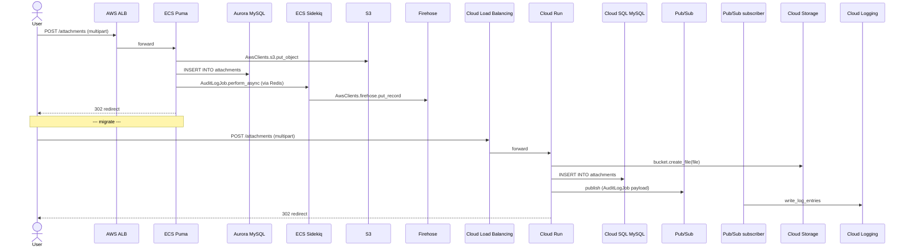

# Generate Phase: User-Journey Synthesis

> Loaded by `generate.md` after `generate-artifacts-scripts.md` completes and before `generate-artifacts-docs.md` runs. Produces the `user-journeys/` artifact directory consumed by `MIGRATION_GUIDE.md` and by the parity-verification step in the feedback phase.

**Execute ALL steps in order. Do not skip or optimize.**

---

## Overview

Synthesize end-to-end user journeys (e.g. "Signup", "File upload") that anchor the migration in actual user-visible flows instead of just infra-to-infra service swaps. Each journey is a deterministic walk across:

1. An HTTP route (from `app-routes.json`) and the controller / action that backs it
2. Every AWS SDK call site that controller triggers (from `aws-sdk-usage.json`)
3. The GCP equivalent for each call site (from `sdk-migration-plan.json` and `gcp-design.json`)

Journeys are **derived**, never invented. If the inputs are missing, the file emits a single graceful-degradation note and exits — see Step 0.

**Outputs:**

- `$MIGRATION_DIR/user-journeys/<NNN>-<name>.md` — narrative + decision rationale per journey
- `$MIGRATION_DIR/user-journeys/<NNN>-<name>.mmd` — Mermaid `sequenceDiagram` showing AWS vs GCP side by side
- `$MIGRATION_DIR/user-journeys/<NNN>-<name>.sh` — curl-based parity test runnable against `$ALB_URL` and `$CLOUD_RUN_URL`
- `$MIGRATION_DIR/user-journeys/index.md` — catalog of every journey with status, criticality, and the Terraform resources that back it
- `$MIGRATION_DIR/user-journeys/user-journeys.md` — single sentinel file (only when inputs are missing — see Step 0)

## Step 0: Path Discipline and Input Gate

Every file produced by this sub-file MUST live under `$MIGRATION_DIR/user-journeys/`. NEVER write to project root (cwd), NEVER overwrite the source project's `README.md`, NEVER emit a helper Python parser script. See **SKILL.md > File Output Discipline (CRITICAL)** for the full rule set.

**Input gate — check files in this order and route accordingly:**

1. **No `app-routes.json` at all**, OR `app-routes.json` exists but `routes[]` is empty (`framework: null` or zero routes parsed): create `$MIGRATION_DIR/user-journeys/` and write **only** `$MIGRATION_DIR/user-journeys/user-journeys.md` containing the exact single line:

   > No routes file found in inventory; user journeys could not be derived. Skipping.

   Skip Steps 1-4. Report to the parent orchestrator `"User journeys skipped (no routes file in inventory)."` and return. Do NOT fail Generate — this is graceful degradation.

2. **`app-routes.json` has routes but `aws-sdk-usage.json` is missing**: the journeys can still be synthesized but they will show only the HTTP layer (no per-step SDK call mapping). Proceed to Step 1 with an empty `call_sites_by_controller` map and write journeys that mark `aws_sdk_calls: []` for each step.

3. **Both `app-routes.json` (non-empty `routes[]`) and `aws-sdk-usage.json` exist**: proceed to Step 1 with full inputs. Also Read `gcp-design.json` and (if it exists) `sdk-migration-plan.json` to look up GCP equivalents.

## Step 1: Load Inputs and Build Lookup Maps

Read these artifacts (use the Read tool — do NOT emit a parser script):

- `$MIGRATION_DIR/app-routes.json` (REQUIRED past the gate)
- `$MIGRATION_DIR/aws-sdk-usage.json` (REQUIRED past the gate; may be empty per gate case 2)
- `$MIGRATION_DIR/gcp-design.json` (REQUIRED — used to attach the backing GCP service to each journey step)
- `$MIGRATION_DIR/sdk-migration-plan.json` (OPTIONAL — when present, supplies the per-call-site GCP SDK target)
- `$MIGRATION_DIR/aws-resource-inventory.json` (OPTIONAL — supplies Terraform addresses for the `index.md` "backing resources" column)

Build the following in-memory lookup maps. Do not write these to disk — they are scratchpads:

- `routes_by_controller`: `controller -> [route, ...]` (group `routes[]` from `app-routes.json` by `controller`)
- `call_sites_by_file`: `file_path -> [call_site, ...]` (group `aws-sdk-usage.json.call_sites[]` by `file`)
- `gcp_target_for_aws_op`: `(aws_service, aws_op) -> {gcp_sdk, gcp_op, snippet}` from `sdk-migration-plan.json.translations[]` (if present)
- `gcp_service_for_aws_address`: `aws_address -> gcp_service` from `gcp-design.json.clusters[].resources[]`

## Step 2: Group Routes into Journeys

Walk `routes[]` and bucket each route into a journey using these **deterministic** semantic patterns (apply in the order below; first match wins). Do not invent journeys for patterns that don't match — leave unmatched routes for the catch-all bucket in step 2.7.

| Pattern (path matched case-insensitive, verb in the listed set) | Journey name |
| --- | --- |
| Path contains `/users/sign_up`, `/register`, `/signup`, or `/users` (POST + new = create form) | **Signup journey** |
| Path contains `/users/sign_in`, `/login`, `/sessions` (POST), or `/auth/callback` | **Sign-in journey** |
| Path contains `/attachments`, `/uploads`, `/files`, `/media` with verb POST or PUT | **File upload journey** |
| Path contains `/checkout`, `/orders`, `/payments`, `/subscriptions` with verb POST | **Purchase journey** |
| Path contains `/quiz`, `/survey`, `/exam`, `/assessment` (any verb) | **Quiz journey** |
| Path matches CRUD triplet (`/<resource>` GET index + `/<resource>/new` GET + `/<resource>` POST) | **<Resource> create journey** (e.g. `posts` → "Posts create journey") |
| Controller is referenced as the `file` for a call site that enqueues background work (`perform_async`, `enqueue`, `publish`, `send_message`, `put_record` to a Firehose used as a fan-out, etc., as detected via `aws-sdk-usage.json`) | **<Action> fan-out journey** (use the verb of the controller action as `<Action>`) |
| Anything else with `requires_auth: true` and verb in {POST, PUT, PATCH, DELETE} | **<Controller-base> write journey** (low priority — emit as one journey per controller, capped at 3 total) |

2.7 **Catch-all cap:** at most 8 journeys per migration run. If more candidates remain after applying the patterns, keep the 8 with the **highest criticality** (auth + payment + write-path = high; pure-read admin paths = low) and discard the rest. The discarded routes still appear in `index.md` under "Routes not modeled as journeys".

## Step 3: Build Each Journey Sequence

For each journey selected in Step 2, build a deterministic sequence by walking the routes that belong to it:

1. **HTTP entry**: `User -> ALB / API Gateway target -> controller#action` from `app-routes.json`.
2. **AWS SDK calls**: For each route's controller, look up `call_sites_by_file` keyed on the file that holds the controller (e.g. `app/controllers/attachments_controller.rb`). For each call site, record `aws_service`, `aws_op`, `file`, `line`. Preserve the source order (by line number).
3. **Background-job enqueue sites**: Scan the same controller's call sites for the enqueue patterns above (`perform_async`, `enqueue`, `publish`, `put_record`). Each enqueue spawns a downstream worker that gets its own row in the sequence diagram.
4. **GCP equivalents**: For each AWS SDK call, look up `gcp_target_for_aws_op` first. If absent (because `sdk-migration-plan.json` doesn't exist or the row is TODO-stubbed), fall back to `gcp_service_for_aws_address` using the AWS resource the call probably targets — this is a best-effort fallback; mark the resulting sequence step `confidence: "inferred"`. If neither lookup yields a target, mark the step `gcp_target: null` and the step's narrative line as `"GCP equivalent: unknown — see sdk-migration-plan.json"`.

## Step 4: Emit Per-Journey Files

For each journey, write three files. Numbering starts at `001` and matches the order journeys appear in `index.md`. Use kebab-case for `<name>`.

### 4.1 `<NNN>-<name>.md` (narrative)

```markdown
# Journey <NNN>: <Journey name>

> Derived from app-routes.json + aws-sdk-usage.json + gcp-design.json. Edit by re-running discover and generate, not by hand.

## Routes covered

| Verb | Path | Controller#action | Requires auth |
| --- | --- | --- | --- |
| POST | /attachments | AttachmentsController#create | true |

## Sequence (AWS today)

1. User submits POST /attachments (multipart) -> ALB -> ECS Puma task running AttachmentsController#create.
2. Controller calls AwsClients.s3.put_object (line app/controllers/attachments_controller.rb:14).
3. Controller writes attachment row to Aurora MySQL.
4. Controller enqueues AuditLogJob via Sidekiq (perform_async at app/controllers/attachments_controller.rb:22), which writes a Firehose record.

## Sequence (GCP after cutover)

1. User submits POST /attachments (multipart) -> Cloud Load Balancing -> Cloud Run service running the same controller code (after sdk-migration-plan patch).
2. Controller calls storage.bucket(...).create_file(...) on Cloud Storage (deterministic — sourced from sdk-migration-plan.json).
3. Controller writes attachment row to Cloud SQL MySQL (engine preserved per design-refs/database.md).
4. Controller publishes the audit-log message to Pub/Sub; a Cloud Run subscriber writes the event to Cloud Logging.

## Why this matters

- Anchors Phase 8 parity verification on a real user-visible flow.
- Justifies the migration ordering for the backing cluster (the controller cannot move before its Cloud SQL and Cloud Storage targets exist).
- Maps directly to ADRs <list every ADR whose Consequences section references this journey>.

## Decision rationale

- AWS Aurora MySQL -> Cloud SQL MySQL: engine preservation (see adrs/<NN>-aurora-mysql-to-cloud-sql.md).
- AWS Firehose -> Pub/Sub + Cloud Logging subscriber: see adrs/<NN>-firehose-to-pubsub.md.
- AWS Sidekiq via Redis -> Pub/Sub: deferred-state worker eliminated; see adrs/<NN>-sidekiq-to-pubsub.md.

## Parity test

Run `./user-journeys/<NNN>-<name>.sh` against the AWS ALB URL and the Cloud Run URL after deploy. The script asserts the HTTP status, response headers, and a body-shape diff are equivalent.
```

### 4.2 `<NNN>-<name>.mmd` (Mermaid)

Write a Mermaid `sequenceDiagram` showing AWS first, then a `Note over` divider, then GCP. Start file at line 1 with `sequenceDiagram` — no surrounding ` ```mermaid ` fence — the file extension is `.mmd`.

The skeleton below is the **canonical reference template** — copy it verbatim and replace participant + arrow lines with the actual AWS / GCP services for this journey. Mermaid syntax notes:

- `actor User` declares a stick-figure actor (must appear before the first arrow referencing `User`).
- `participant <Short> as <Long Label>` declares a service box. The `<Short>` token is what arrows use; the `as <Long Label>` is what renders.
- Arrows: `A->>B: message` is solid (synchronous request); `A-->>B: message` is dashed (response). `Note over A,B: text` draws a labeled note spanning two participants.
- Lines must NOT begin with leading whitespace inside the diagram block when authored in raw `.mmd`; Mermaid is tolerant but some renderers (e.g. GitHub) reject indented arrows.



When emitting the actual file, drop the ` ```mermaid ` fence — write the raw `sequenceDiagram` ... lines starting at line 1.

### 4.3 `<NNN>-<name>.sh` (parity test)

```bash
#!/usr/bin/env bash
set -euo pipefail

# Journey <NNN>: <name> -- parity test
# Usage: ALB_URL=https://aws.example.com CLOUD_RUN_URL=https://gcp.example.com ./<NNN>-<name>.sh
# Exits 0 if AWS and GCP responses match on status code and primary response shape; non-zero otherwise.

: "${ALB_URL:?ALB_URL is required (e.g. https://aws.example.com)}"
: "${CLOUD_RUN_URL:?CLOUD_RUN_URL is required (e.g. https://gcp.example.com)}"

# One curl invocation per route in the journey. Example for POST /attachments:
aws_resp=$(curl -sS -o /tmp/aws-body -w '%{http_code}' \
    -X POST "$ALB_URL/attachments" \
    -F "file=@./fixtures/sample.png" \
    -H "Authorization: Bearer $TEST_TOKEN")
gcp_resp=$(curl -sS -o /tmp/gcp-body -w '%{http_code}' \
    -X POST "$CLOUD_RUN_URL/attachments" \
    -F "file=@./fixtures/sample.png" \
    -H "Authorization: Bearer $TEST_TOKEN")

if [[ "$aws_resp" != "$gcp_resp" ]]; then
    echo "FAIL status: AWS=$aws_resp GCP=$gcp_resp" >&2
    exit 1
fi

# Diff the body shape (strip volatile fields: timestamps, IDs).
diff <(jq 'del(.id, .created_at, .updated_at)' /tmp/aws-body) \
     <(jq 'del(.id, .created_at, .updated_at)' /tmp/gcp-body) \
    || { echo "FAIL body diff" >&2; exit 2; }

echo "PASS journey <NNN> <name>"
```

Make the file executable (`chmod +x`) is the user's responsibility — the script harness does not chmod files.

## Step 5: Emit `index.md`

Write `$MIGRATION_DIR/user-journeys/index.md` listing every synthesized journey, plus a "Routes not modeled as journeys" section for the catch-all cap from Step 2.7.

```markdown
# User Journeys (derived)

> Derived from `app-routes.json`, `aws-sdk-usage.json`, `gcp-design.json`, and (when present) `sdk-migration-plan.json`. Re-run discover and generate to regenerate.

| # | Journey | Status | Criticality | Backing Terraform resources |
| --- | --- | --- | --- | --- |
| 001 | Signup journey | derived | high | terraform/database.tf (cloud_sql_users), terraform/security.tf (firebase_auth) |
| 002 | File upload journey | derived | high | terraform/storage.tf (gcs_attachments), terraform/compute.tf (cloud_run_app) |
| 003 | Audit fan-out journey | derived | medium | terraform/messaging.tf (pubsub_audit_log) |

## Routes not modeled as journeys

- GET /healthz -> HealthController#show (read-only health check; below criticality cap)
- GET /admin/users -> Admin::UsersController#index (admin read; below criticality cap)
```

**Criticality assignment (deterministic):**

- **high**: any route in the journey has `requires_auth: true` AND verb in `{POST, PUT, PATCH, DELETE}`; OR the journey covers payment / checkout / order / subscription paths; OR the journey covers an upload (S3 put / GCS create).
- **medium**: fan-out journeys whose downstream worker writes audit / log data; non-auth POST/PUT flows.
- **low**: read-only journeys, admin-side journeys, and the catch-all "<Controller-base> write journey" bucket.

**Backing Terraform resources** column: cross-reference `gcp-design.json.clusters[].resources[]` for each AWS SDK call's target service, look up which `terraform/*.tf` file Generate emitted that resource into (from `generation-infra.json` if it carries per-resource file mappings; otherwise list the conventional file by category — `compute.tf`, `database.tf`, `storage.tf`, `messaging.tf`, `security.tf`).

## Step 6: Self-Check

Before reporting completion, verify:

1. **Path discipline**: every file written lives under `$MIGRATION_DIR/user-journeys/`. No file was written to project root or to `$MIGRATION_DIR/scripts/`. No `.py` helper script was emitted.
2. **File set**: one `.md` + one `.mmd` + one `.sh` per journey listed in `index.md`. `index.md` exists.
3. **Anchored to artifacts**: every controller / SDK call / GCP target mentioned in any journey file traces back to a concrete entry in `app-routes.json`, `aws-sdk-usage.json`, `sdk-migration-plan.json`, or `gcp-design.json`. If you cannot point to the source line, delete the journey rather than guess.
4. **Mermaid sanity**: the first line of every `.mmd` file is `sequenceDiagram`. Each `participant <Short>` (or `participant <Short> as <Label>`) declaration appears before any arrow that uses `<Short>`. `actor User` precedes the first `User->>...` arrow. No leading-whitespace arrows at column 0 of the line.
5. **Graceful degradation**: if Step 0's gate fired, the only file under `user-journeys/` is `user-journeys.md` containing the exact graceful-degradation line; no `index.md`, no per-journey files.

## Phase Completion

Report the list of generated journey files to the parent `generate.md`. Do NOT update `.phase-status.json` — the parent handles phase completion.

Output:

```
Generated user journeys:
- user-journeys/index.md (N journeys, M routes covered, K routes not modeled)
- user-journeys/<NNN>-<name>.md / .mmd / .sh (one set per journey)
```
