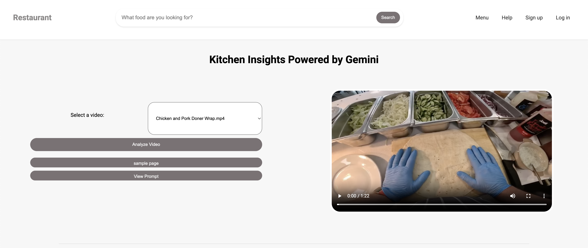
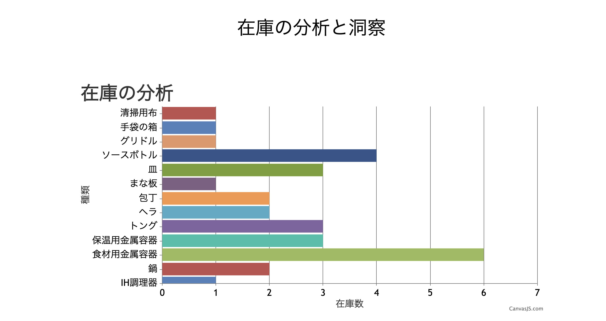
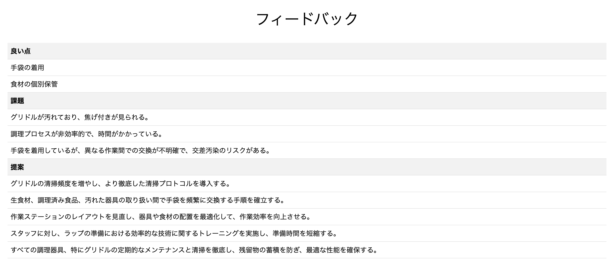

# Vertex AI Gemini API と連携する Flask アプリケーション

| | |
| --- | --- |
| 日本版更新者 | [Nozomu Yoshida](https://gitlab.com/nozoyoshida)|
| 日本版作成者 | Kanoko Suzuki |
| 日本版レビュワー | [Etsuji Nakai](https://gitlab.com/enakai)|
| US版作成者 | [Alejandro Ballesta](https://gitlab.com/alejandrobr1) |

# Google Gemini による動画分析

この Flask アプリケーションは、Google Cloud Storage にアップロードされた動画を、多言語対応の Google Gemini API を使用して分析します。食事の準備のタイムスタンプを抽出し、在庫、安全性、潜在的な問題に関する洞察、および改善のための提案を提供します。

## 特徴

- **食事準備のタイムスタンプ:** 動画内の各食事の準備の開始時刻と終了時刻を特定し、平均準備時間を計算します。
- **在庫見積もり:** キッチンで見えるさまざまな食材やアイテムの量を概算します。
- **安全性評価:** 動画で観察された肯定的な安全慣行と潜在的な危険の両方を検出して報告します。
- **問題の特定:** 食品調理プロセスにおける運用上の問題やエラーを強調します。
- **ビデオクリップ生成:** 個々の食事準備の短いクリップを作成します。

## アプリケーションのプレビュー

## 要件

- **Python 3.7 以降**
- **Flask**
- **Google Cloud プロジェクト** と以下のもの:
- **Gemini API が有効になっていること**
- **動画アップロード用の Google Cloud Storage バケット**
- **Vertex AI API が有効になっていること**
- **Google Cloud Storage および Vertex AI API へのアクセス権を持つサービスアカウント**
- **以下の Python パッケージ:**
- `google-cloud-storage`
- `vertexai`
- `google-genai`

## 実行環境

Cloud Workstation での実行を想定しています。Cloud Run へのデプロイはサポートされていません。

## コード構造

- `app.py`: メインの Flask アプリケーションファイル。以下のためのルートと関数が含まれています。
- 動画のアップロードと保存の処理。
- 動画分析のための Google Gemini API との連携。
- 結果を表示するための HTML テンプレートのレンダリング。
- `templates/`: ユーザーインターフェイス用の HTML テンプレートが含まれています。
- `static/`: CSS や JavaScript などの静的ファイルが保存されています。

## 使用技術

Flask+HTML: アプリケーションと対話するためのユーザーフレンドリーなウェブインターフェイスを作成します。
Cloud Storage: ユーザーからの入力動画を保存します。
Vertex AI Gemini API: 適切なフレームを選択し、画像を編集するための強力な生成 AI 機能を提供します。
使用モデル: Gemini 2.5 Flash
