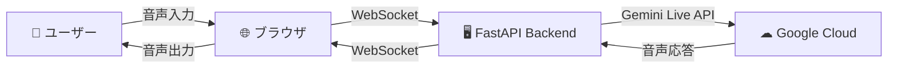

# ☕ Starlight Cafe - Gemini Live API 音声対話


**Google Cloud Gemini Live APIを活用したリアルタイム音声対話ハンズオンアプリ**

このアプリは、架空のカフェ「Starlight Cafe」の電話対応をシミュレーションする、AIエージェント「Patrick」との音声通話Webアプリです。 Gemini Live APIのリアルタイム音声対話能力と、Function Callingによるタスク実行能力を体験できます。

このアプリは[Etsujiさんのvideo-monitoring-handson](https://github.com/google-cloud-japan/sa-ml-workshop/tree/main/video-monitoring-handson)のsample02アプリをベースに作成したものです。

## 📋 全体像

### 🎪 デモの概要
- **テーマ**: 架空のカフェ「Starlight Cafe」の電話対応システム
- **AI エージェント**: Patrick（パトリック）- 親切な電話対応スタッフ
- **コア技術**: 
  - **フロントエンド ↔ バックエンド**: WebSocket通信
  - **バックエンド ↔ Google Cloud**: Gemini Live API
  - **Function Calling**: 注文確認の自動化
- **体験内容**: リアルタイム双方向音声ストリーミング + インテリジェント注文管理

### 🏗️ アーキテクチャ
ユーザーの音声はブラウザを通じてFastAPIのバックエンドに送信され、そこからGemini Live APIにストリーミングされます。  AIからの音声応答は逆の経路でユーザーに返されます。
- **モデル**: gemini-live-2.5-flash
- **通信**: フロントエンド ↔ バックエンド間はWebSocketで接続



### 📁 プロジェクト構成

```
Cafe-Agent-Gemini/
├── README.md                    # このファイル
├── deploy.sh                    # Cloud Runへのデプロイスクリプト
├── start_handson.sh             # Cloud Shellでハンズオン開始スクリプト
├── requirements.txt             # Python依存関係
├── backend/                     # バックエンド (FastAPI + Gemini Live API)
│   ├── main.py                 # メインアプリケーション
│   ├── system_instruction.py   # 🎯 ハンズオン・カスタマイズ設定ファイル
│   ├── requirements.txt        # Python依存関係
│   └── Dockerfile             # バックエンド用Dockerイメージ
└── frontend/                   # フロントエンド (Next.js)
    ├── pages/                  # Next.jsページ
    │   └── index.js           # メインページ
    ├── components/            # Reactコンポーネント
    │   └── VoiceClient.js     # 音声通話コンポーネント
    ├── lib/                   # ライブラリ
    │   ├── voicecall-backend.js    # バックエンドAPI接続
    │   └── live-audio-manager.js   # 音声入出力管理
    ├── package.json           # Node.js依存関係
    └── Dockerfile            # フロントエンド用Dockerイメージ
```


### 1. **環境要件**
- **Node.js**: 22.15.0以上
- **Python**: 3.9以上
- **Google Cloud Platform**: アカウントとプロジェクト

### 2. **Google Cloud設定**

#### 📋 プロジェクト作成と課金設定
1. [Google Cloud Console](https://console.cloud.google.com/)でプロジェクトを作成
2. 課金アカウントを有効化（Gemini Live API使用に必要）

#### 🔑 認証設定（2つの方法から選択）

**Google Cloud SDK使用**
```bash
# 1. Google Cloud SDKをインストール
# https://cloud.google.com/sdk/docs/install

# 2. 認証設定
gcloud auth login
gcloud auth application-default login
gcloud config set project YOUR_PROJECT_ID
```

#### 🚀 APIの有効化
```bash
# Vertex AI APIを有効化
gcloud services enable aiplatform.googleapis.com
```

### 3. **ローカル環境設定**

#### バックエンド
```bash
cd backend

# Python仮想環境作成
python -m venv venv

# 仮想環境有効化
# Windows:
venv\Scripts\activate
# macOS/Linux:
source venv/bin/activate

# 依存関係インストール
pip install -r requirements.txt
```

#### フロントエンド
```bash
cd frontend

# Node.js依存関係インストール
npm install

# 環境変数ファイル作成
echo "NEXT_PUBLIC_BACKEND_URL=ws://localhost:8081/ws" > .env.local
```

## 🎮 使用方法

### 🚀 アプリケーション起動

**ターミナル1: バックエンド起動**
```bash
cd backend
python main.py
# → http://localhost:8081 で起動
```

**ターミナル2: フロントエンド起動**
```bash
cd frontend
npm run dev
# → http://localhost:3000 で起動
```

### 🎙️ 音声対話の流れ

1. **🌐 ブラウザアクセス**: 
2. **☕ 接続**: 「カフェに電話をかける」ボタンをクリックすると、AIエージェントのPatrickから挨拶があります。
3. **🎤 音声入力**: 話しかける
4. **🤖 AI応答**: Patrickがリアルタイムで応答し、会話から注文内容を理解します
5. **🔄 会話継続**: 自然な対話を楽しむ。注文が完了すると、PatrickはFunction Callingを自律的に実行し、画面に注文内容の要約を表示します
6. **📞 終了**: 「通話を終了」ボタンで切断

### 💬 会話例

**📞 基本的な問い合わせ**
```
👤 ユーザー: 「メニューを教えてください」
🤖 Patrick: 「承知いたしました。コーヒー類ではドリップコーヒーが450円、カフェラテが550円...」

👤 ユーザー: 「おすすめはありますか？」
🤖 Patrick: 「当店の人気No.1はカフェラテです。まろやかな味わいで...」
```

**🛒 注文から確認まで**
```
👤 ユーザー: 「カフェラテとアップルパイをお願いします」
🤖 Patrick: 「承知いたしました。カフェラテとアップルパイが一つずつですね。ほかに注文したいものはございますか？」

👤 ユーザー: 「それでお願いします」
🤖 Patrick: 「かしこまりました。ご注文内容を復唱いたします」

💻 【画面に自動表示される注文確認UI】← 注文確認ツールを有効にした場合のみ
📋 ご注文内容の確認
🍽️ カフェラテ × 1      550円
🍽️ アップルパイ × 1    520円
合計: 1,070円
お受け取り予定: 15分後

👤 ユーザー: 間違いないです。お願いします。
🤖 Patrick: 「ありがとうございます。15分後にご用意いたします」
```

## 🧑‍💻 コードの説明

### 📱 フロントエンド (`frontend/components/VoiceClient.js`)

#### 🔧 主要機能
- **WebSocket接続管理**: バックエンドとの双方向通信
- **音声入出力制御**: マイクアクセスとスピーカー出力
- **UI状態管理**: 接続状態、マイク状態の表示

### 🖥️ バックエンド (`backend/main.py`)

#### 🔧 主要機能
- **Gemini Live API連携**: リアルタイム音声AI処理
- **音声ストリーミング**: PCM音声データの双方向転送
- **WebSocketサーバー**: フロントエンドとの接続管理
- **Function Calling**: 注文確認ツールの自動実行
- **構造化データ生成**: 音声会話から注文データを抽出

#### 📝 プロンプト設定

**🎯 ハンズオン・カスタマイズ専用ファイル: `backend/system_instruction.py`**

ハンズオン時にカスタマイズする設定は、すべて`system_instruction.py`に分離されています。  
`main.py`を直接編集する必要がなく、安全にカスタマイズできます。

**1. 音声設定**
```python
# 音声の種類を選択
VOICE_NAME = 'Puck'     # ["Aoede", "Puck", "Charon", "Kore", "Fenrir", "Leda", "Orus", "Zephyr"]
LANGUAGE = 'Japanese'   # English, Japanese, Korean
```

**2. システムプロンプト**
```python
SYSTEM_INSTRUCTION = '''
あなたは「Starlight Cafe」のPatrickです。
# 🎯 ここを編集してオリジナルエージェントを作成！
'''
```

**3. AI応答設定**
```python
AI_TEMPERATURE = 0.6  # ランダム性・創造性レベル (0.0-1.0)
AI_TOP_P = 0.6        # 応答の多様性 (0.0-1.0)
```

**📝 編集手順:**
1. `backend/system_instruction.py`を開く
2. `SYSTEM_INSTRUCTION`変数を編集
3. 音声設定（`VOICE_NAME`、`LANGUAGE`）も必要に応じて調整

## ⚙️ 環境変数による機能制御

### 🔧 Function Calling（注文確認ツール）の切り替え

このアプリは環境変数によってFunction Calling機能の有効/無効を切り替えることができます。

**環境変数設定:**
```bash
# Function Calling有効化（デフォルト: 無効）
export USE_ORDER_TOOL=true
```

**切り替え手順:**

**1. 🔍 ローカル開発環境の場合**
```bash
# ツールを有効にする
export USE_ORDER_TOOL=true
python backend/main.py

# ツールを無効にする（デフォルト）
export USE_ORDER_TOOL=false
python backend/main.py
```

**2. ☁️ Cloud Runデプロイの場合**
```bash
# デプロイ時に環境変数を設定
gcloud run deploy starlight-cafe-backend \
  --source backend/ \
  --set-env-vars USE_ORDER_TOOL=true \
  --region us-central1
```

**機能の違い:**

| 設定 | Function Calling | 動作内容 |
|------|------------------|----------|
| `USE_ORDER_TOOL=true` | ✅ 有効 | 注文内容の自動確認・構造化データ生成 |
| `USE_ORDER_TOOL=false` | ❌ 無効 | 通常の音声対話のみ（注文確認UI非表示） |

**📋 ツール有効時の追加機能:**
- 自動注文内容確認
- 画面への注文サマリー表示
- 構造化された注文データ生成
- より詳細な接客プロンプト適用

## 🐛 トラブルシューティング

### よくある問題と解決方法

**❌ 認証エラー**
```
google.auth.exceptions.DefaultCredentialsError
```
→ Google Cloud認証を再実行: `gcloud auth application-default login`

**❌ 接続エラー**
```
WebSocket connection failed
```
→ `.env.local`ファイルの`NEXT_PUBLIC_BACKEND_URL`を確認

**❌ system_instruction.pyが見つからない**
```
ModuleNotFoundError: No module named 'system_instruction'
```
→ `backend/`ディレクトリに`system_instruction.py`ファイルが存在するか確認

**❌ 音声が聞こえない**
→ ブラウザのマイク・スピーカー許可を確認

**❌ AIが応答しない**
→ `system_instruction.py`のシステムプロンプトの内容とGemini Live APIの制限を確認

**❌ カスタマイズが反映されない**
→ バックエンドを再起動してください（`python main.py`）

### 🆘 サポート

問題が解決しない場合は以下を確認してください：
1. **ログの確認**: ブラウザ開発者ツールとバックエンドログ
2. **環境変数**: 必要な設定がすべて正しく設定されているか
3. **ネットワーク**: ファイアウォールやプロキシの設定
4. **課金設定**: Google Cloudの課金が有効になっているか

## 📚 参考資料

- [Gemini Live API公式ドキュメント](https://ai.google.dev/gemini-api/docs/live)
- [Google Cloud認証ガイド](https://cloud.google.com/docs/authentication)
- [Etsujiさんのvideo-monitoring-handson](https://github.com/google-cloud-japan/sa-ml-workshop/tree/main/video-monitoring-handson)
