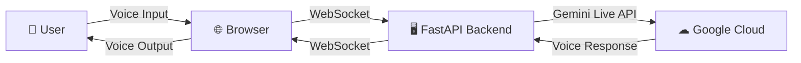

# ☕ Starlight Cafe - Gemini Live API Voice Conversation Application


**Real-time voice conversation hands-on app using Google Cloud Gemini Live API**

This app simulates telephone service for the fictional cafe "Starlight Cafe", providing a voice call web application with AI agent "Patrick". You can experience the real-time voice conversation capabilities of Gemini Live API and task execution through Function Calling.

This app is based on the sample02 app from [Etsuji's video-monitoring-handson](https://github.com/google-cloud-japan/sa-ml-workshop/tree/main/video-monitoring-handson).

## 📋 Overall Content Overview

### 🎪 Demo Overview
- **Theme**: Telephone service system for the fictional cafe "Starlight Cafe"
- **AI Agent**: Patrick - A friendly telephone service staff
- **Core Technologies**: 
  - **Frontend ↔ Backend**: WebSocket communication
  - **Backend ↔ Google Cloud**: Gemini Live API
  - **Function Calling**: Automated order confirmation
- **Experience**: Real-time bidirectional audio streaming + Intelligent order management

### 🏗️ Architecture
User voice is sent to the FastAPI backend through the browser, then streamed to Gemini Live API. AI voice responses are returned to the user via the reverse path.
- **Model**: gemini-live-2.5-flash
- **Communication**: WebSocket connection between frontend and backend



### 📁 Project Structure

```
2_Gemini Live API/
├── README.md                    # This file
├── deploy.sh                    # Cloud Run deployment script
├── start_handson.sh             # Cloud Shell hands-on start script
├── requirements.txt             # Python dependencies
├── backend/                     # Backend (FastAPI + Gemini Live API)
│   ├── main.py                 # Main application
│   ├── system_instruction.py   # 🎯 Hands-on customization settings file
│   ├── requirements.txt        # Python dependencies
│   └── Dockerfile             # Backend Docker image
└── frontend/                   # Frontend (Next.js)
    ├── pages/                  # Next.js pages
    │   └── index.js           # Main page
    ├── components/            # React components
    │   └── VoiceClient.js     # Voice call component
    ├── lib/                   # Libraries
    │   ├── voicecall-backend.js    # Backend API connection
    │   └── live-audio-manager.js   # Audio input/output management
    ├── package.json           # Node.js dependencies
    └── Dockerfile            # Frontend Docker image
```

### 🎙️ Voice Conversation Flow

1. **🌐 Browser Access**: 
2. **☕ Connection**: Click the "Call the Cafe" button, and AI agent Patrick will greet you.
3. **🎤 Voice Input**: Speak to the system
4. **🤖 AI Response**: Patrick responds in real-time and understands order details from the conversation
5. **🔄 Continue Conversation**: Enjoy natural dialogue. When the order is complete, Patrick autonomously executes Function Calling and displays order summary on screen
6. **📞 End**: Disconnect with the "End Call" button

### 💬 Conversation Examples

**📞 Basic Inquiries**
```
👤 User: "Please tell me about your menu"
🤖 Patrick: "Certainly. For coffee, we have drip coffee for 450 yen, cafe latte for 550 yen..."

👤 User: "Do you have any recommendations?"
🤖 Patrick: "Our most popular item is the cafe latte. It has a smooth, mellow flavor..."
```

**🛒 From Order to Confirmation**
```
👤 User: "I'd like a cafe latte and apple pie please"
🤖 Patrick: "Certainly. One cafe latte and one apple pie. Would you like anything else?"

👤 User: "That's all, please"
🤖 Patrick: "Understood. Let me repeat your order"

💻 【Order confirmation UI automatically displayed on screen】
📋 Order Confirmation
🍽️ Cafe Latte × 1      550 yen
🍽️ Apple Pie × 1       520 yen
Total: 1,070 yen
Ready in: 15 minutes

👤 User: That's correct. Please proceed.
🤖 Patrick: "Thank you. We'll have it ready in 15 minutes"
```

## 🧑‍💻 Code Explanation

### 📱 Frontend (`frontend/components/VoiceClient.js`)

#### 🔧 Main Features
- **WebSocket Connection Management**: Bidirectional communication with backend
- **Audio Input/Output Control**: Microphone access and speaker output
- **UI State Management**: Display of connection status and microphone status

### 🖥️ Backend (`backend/main.py`)

#### 🔧 Main Features
- **Gemini Live API Integration**: Real-time voice AI processing
- **Audio Streaming**: Bidirectional transfer of PCM audio data
- **WebSocket Server**: Connection management with frontend
- **Function Calling**: Automated execution of order confirmation tools
- **Structured Data Generation**: Extract order data from voice conversations


## 🐛 Troubleshooting

### Common Issues and Solutions

**❌ Authentication Error**
```
google.auth.exceptions.DefaultCredentialsError
```
→ Re-run Google Cloud authentication: `gcloud auth application-default login`

**❌ Connection Error**
```
WebSocket connection failed
```
→ Check `NEXT_PUBLIC_BACKEND_URL` in `.env.local` file

**❌ system_instruction.py not found**
```
ModuleNotFoundError: No module named 'system_instruction'
```
→ Check if `system_instruction.py` file exists in `backend/` directory

**❌ No audio**
→ Check browser microphone and speaker permissions

**❌ AI not responding**
→ Check system prompt content in `system_instruction.py` and Gemini Live API limitations

**❌ Customization not reflected**
→ Please restart the backend (`python main.py`)

### 🆘 Support

If issues persist, please check the following:
1. **Log Check**: Browser developer tools and backend logs
2. **Environment Variables**: Verify all necessary settings are correctly configured
3. **Network**: Firewall and proxy settings

## 📚 References

- [Gemini Live API Official Documentation](https://ai.google.dev/gemini-api/docs/live)
- [Google Cloud Authentication Guide](https://cloud.google.com/docs/authentication)
- [Etsuji's video-monitoring-handson](https://github.com/google-cloud-japan/sa-ml-workshop/tree/main/video-monitoring-handson)
