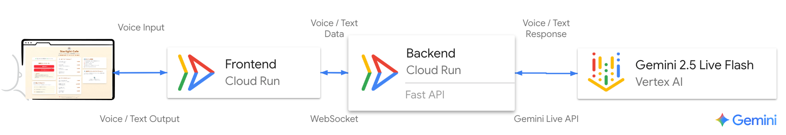

# ☕ Starlight Cafe - Gemini Live API 音声対話


## **Google Cloud Gemini Live API を活用したリアルタイム音声対話ハンズオンアプリ**

このアプリは、架空のカフェ「Starlight Cafe」の電話対応をシミュレーションする、AI エージェント「Patrick」との音声通話 Web アプリです。 Gemini Live API のリアルタイム音声対話能力と、Function Calling によるタスク実行能力を体験できます。

このアプリは[Etsuji さんの video-monitoring-handson](https://github.com/google-cloud-japan/sa-ml-workshop/tree/main/video-monitoring-handson) の sample02 アプリをベースに作成したものです。

## 📋 全体像

### 🎪 デモの概要
- **テーマ**: 架空のカフェ「Starlight Cafe」の電話対応システム
- **AI エージェント**: Patrick（パトリック）- 親切な電話対応スタッフ
- **コア技術**: 
  - **フロントエンド ↔ バックエンド**: WebSocket 通信
  - **バックエンド ↔ Google Cloud**: Gemini Live API
  - **Function Calling**: 注文確認の自動化
- **体験内容**: リアルタイム双方向音声ストリーミング + インテリジェント注文管理

### 🏗️ アーキテクチャ
ユーザーの音声はブラウザを通じて FastAPI のバックエンドに送信され、そこから Gemini Live API にストリーミングされます。AI からの音声応答は逆の経路でユーザーに返されます。



### 📁 プロジェクト構成

```
Cafe-Agent-Gemini/
├── README.md                    # このファイル
├── deploy.sh                    # Cloud Run へのデプロイスクリプト
├── start_handson.sh             # Cloud Shell でハンズオン開始スクリプト
├── cleanup.sh                   # リソースを削除・クリーンアップスクリプト
├── requirements.txt             # Python 依存関係
├── backend/                     # バックエンド (FastAPI + Gemini Live API)
│   ├── main.py                 # メインアプリケーション
│   ├── system_instruction.py   # 🎯 ハンズオン・カスタマイズ設定ファイル
│   ├── requirements.txt        # Python 依存関係
│   └── Dockerfile             # バックエンド用 Docker イメージ
└── frontend/                   # フロントエンド (Next.js)
    ├── pages/                  # Next.js ページ
    │   └── index.js           # メインページ
    ├── components/            # React コンポーネント
    │   └── VoiceClient.js     # 音声通話コンポーネント
    ├── lib/                   # ライブラリ
    │   ├── voicecall-backend.js    # バックエンド API 接続
    │   └── live-audio-manager.js   # 音声入出力管理
    ├── package.json           # Node.js 依存関係
    └── Dockerfile            # フロントエンド用 Docker イメージ
```
**[続行]** ボタンをクリックして次のステップに進みます。

## 🚀 ハンズオン手順

### 【前半】Cloud Run へのデプロイと完成形の体験

1. 環境準備

   まず、Google Cloud コンソール右上の「**Cloud Shell をアクティブにする**」ボタンをクリックして、Cloud Shell を起動します。
   もしくは、こちらのボタンをクリックします。
   
   [](https://ssh.cloud.google.com/cloudshell/open?cloudshell_git_repo=https://github.com/GoogleCloudPlatform/gcp-getting-started-lab-jp&cloudshell_git_branch=master&cloudshell_working_dir=minitap/ai_agent_menu/2_gemini_live_api&cloudshell_tutorial=README.md&cloudshell_open_in_editor=README.md)
   
   認証設定を行い、今回使用するプロジェクトを指定します。
    ```bash
    gcloud auth application-default login
    gcloud config set project YOUR_PROJECT_ID
    ```

3. Python の仮装環境を準備

   ```bash
   uv sync
   source .venv/bin/activate
   ```

4. アプリケーションのデプロイ
   
   以下のコマンドを実行して、デプロイ用のスクリプトに実行権限を与えます。

   ```bash
   chmod +x deploy.sh
   ```
   次に、以下のコマンドでデプロイを実行します。完了までには 5-10 分 ほどかかります。
   
   途中で `Do you want to continue (Y/n)?` と聞かれたら、Y を入力して Enter キーを押してください。
   ```bash
   ./deploy.sh
   ```

#### コードを見てみよう

<walkthrough-editor-open-file filePath="./backend/system_instruction.py">backend/system_instruction.py</walkthrough-editor-open-file> を開いて、Agent に与えるシステム指示を確認しましょう。

<walkthrough-editor-open-file filePath="./backend/main.py">backend/main.py</walkthrough-editor-open-file> を開いて、Agent の構造を確認しましょう。

この二つのファイルが、AI の性格や知識を定義し、Google の Gemini Live API と通信する核となる処理を担当します。


5. 完成形の体験
   
   デプロイが完了すると、ターミナルに `Application URL: https://....run.app` が表示されます。
   
   その URL にアクセスし、AI 店員「Patrick」との会話を自由に体験してみましょう。
    
   「☕ **カフェに電話をかける**」ボタンをクリックします。（最初の接続に少し時間がかかる場合があります）
    
   ブラウザからマイクの使用許可を求められたら「**許可**」してください。
    
   Patrick から挨拶が聞こえたら、マイクに向かって話しかけてみましょう。

## 🤖 自分だけのエージェントを作ろう！
### 【後半】Cloud Shell での AI カスタマイズ体験

1. 開発環境の起動

   Cloud Shell のターミナルで、以下のコマンドを実行して、開発環境の自動起動スクリプトに実行権限を与えます。
    ```bash
    chmod +x start_handson.sh
    ```
    以下のコマンドで開発環境を起動します。バックエンドとフロントエンドの準備がすべて自動的に行われます。
    ```bash
    ./start_handson.sh
    ```
    スクリプトが完了メッセージを表示したら、Cloud Shell 右上の「**ウェブでプレビュー**」ボタンをクリックし、
   
   「**ポート 3001 でプレビュー**」を選択します。新しいブラウザタブで開発用のアプリが開きます。

2. 【メイン演習】オリジナル AI エージェントを作ろう！
   
   AI の応答を定義している「システムプロンプト」を編集して、あなただけのオリジナルエージェントを作成します。

   1.　`./start_handson.sh` を実行しているターミナルで、`Ctrl+C` を押して一度サーバーを停止します。
    
   2.　<walkthrough-editor-open-file filePath="./backend/system_instruction.py">ここをクリックして</walkthrough-editor-open-file>プロンプトの設定ファイルを開きます。
    
   3.　`SYSTEM_INSTRUCTION` や `VOICE_NAME` などを自由に編集してみましょう。
    
     - カフェの名前やメニューを変える
     - AI の話し方を丁寧語からカジュアルなものに変える
     - 全く違う業種（例: たこ焼き店、ペットショップ）のスタッフにしてみる

     カスタマイズ例

     以下はたこ焼き屋の店主に変更する例です（system_instruction.py ファイルを編集）：

      ```python
         VOICE_NAME = 'Aoede'  # 音声を変更（女性の声）
         LANGUAGE = 'Japanese'  # 言語設定
         SYSTEM_INSTRUCTION = '''
         あなたは「たこ焼き屋 おおさか」の店主の「マリン」です。
         お客さんに親しみやすく、元気な関西弁で話しかけてください。
         【基本設定】
         * あなたの名前：マリン
         * 店名：たこ焼き屋 おおさか
         * 営業時間：11:00〜21:00（月曜定休）
         * 所在地：大阪府大阪市道頓堀にある昔ながらのたこ焼き屋
         * 出前：提供あり
         【メニュー】
         たこ焼き：
         - 定番たこ焼き（8個）：500円
         - ねぎ焼きたこ焼き（8個）：600円
         - チーズたこ焼き（8個）：650円
         トッピング：
         - ソース：無料
         - マヨネーズ：50円
         - 青のり：50円
         - かつお節：50円
         ドリンク：
         - ビール：400円
         - ラムネ：200円
         - お茶：150円
         【対応スタイル】
         - 元気な関西弁で愛嬌よく接客
         - 「〜やで」「〜やねん」「おおきに」を使用
         - フレンドリーで親しみやすく
         - たこ焼きの焼き加減にこだわりを持つ
         【挨拶例】
         「いらっしゃい〜！たこ焼き屋おおさかのマリンやで〜！
         今日はどないしよか？アツアツのたこ焼き焼いたろか〜？」
         【注意事項】
         - 関西弁で自然に話す
         - たこ焼きの美味しさを自信を持って伝える
         - お客さんとの親しい距離感を大切にする
         
      ```

    
   4.　編集が終わったら、ターミナルに戻り、再度、**起動コマンド**を実行します。
   ```bash
   ./start_handson.sh
   ```
   5.　「ウェブでプレビュー」で開いているブラウザタブを **リロード（再読み込み）** すると、あなたの変更が AI の応答に反映されています。AI との会話を試してみましょう！

## 【応用編】注文確認ツールの体験 (時間がある方向け)
AI が会話内容を理解し、タスク（注文の要約）を自律的に実行する **Function Calling** 機能を有効にします。

1. `./start_handson.sh` を実行しているターミナルで、`Ctrl+C` を押してサーバーを停止します。

2. <walkthrough-editor-open-file filePath="./start_handson.sh">ここをクリックして</walkthrough-editor-open-file> スクリプトを編集します。

3. スクリプトの 3 行目に、以下の 1 行を追加します。今はコメントアウトされているため、「＃」を削除してください。
    ```bash
    export USE_ORDER_TOOL=True
    ```
4. ターミナルに戻り、**再度、起動コマンド**を実行します。
    ```bash
    ./start_handson.sh
    ```
プレビュー画面でカフェの注文を最後まで完了させてみてください。

AI が注文内容を理解すると、自動的に画面に注文確認が表示されるようになります。

## 💬 会話例

**📞 基本的な問い合わせ**
```
👤 ユーザー: 「メニューを教えてください」
🤖 Patrick: 「承知いたしました。コーヒー類ではドリップコーヒーが 450 円、カフェラテが 550 円...」

👤 ユーザー: 「おすすめはありますか？」
🤖 Patrick: 「当店の人気 No.1 はカフェラテです。まろやかな味わいで...」
```

**🛒 注文から確認まで**
```
👤 ユーザー: 「カフェラテとアップルパイをお願いします」
🤖 Patrick: 「承知いたしました。カフェラテとアップルパイが一つずつですね。ほかに注文したいものはございますか？」

👤 ユーザー: 「それでお願いします」
🤖 Patrick: 「かしこまりました。ご注文内容を復唱いたします」

💻 【画面に自動表示される注文確認UI】← 注文確認ツールを有効にした場合のみ
📋 ご注文内容の確認
🍽️ カフェラテ × 1      550 円
🍽️ アップルパイ × 1    520 円
合計: 1,070 円
お受け取り予定: 15 分後

👤 ユーザー: 間違いないです。お願いします。
🤖 Patrick: 「ありがとうございます。15 分後にご用意いたします」
```

## 🧹 ハンズオン終了後のクリーンアップ手順

【**重要**】 ハンズオンで作成したリソースを削除しない限り、継続的に料金が発生します。

以下のスクリプトを実行して、リソースを削除してください。

1. Cloud Shell のターミナルで、以下のコマンドを実行して、クリーンアップスクリプトに実行権限を与えます。
   ```bash
   chmod +x cleanup.sh
   ```
2. 以下のコマンドでスクリプトを実行します。
作成したサービスアカウントとデプロイしたアプリケーションがすべて自動的に削除されます。
   ```bash
   ./cleanup.sh
   ```

## 🐛 トラブルシューティング

### よくある問題と解決方法

**❌ 認証エラー**
```
google.auth.exceptions.DefaultCredentialsError
```
→ Google Cloud 認証を再実行: `gcloud auth application-default login`

**❌ 接続エラー**
```
WebSocket connection failed
```
→ `.env.local`ファイルの`NEXT_PUBLIC_BACKEND_URL`を確認

**❌ 音声が聞こえない**
→ ブラウザのマイク・スピーカー許可を確認

**❌ AIが応答しない**
→ `system_instruction.py` のシステムプロンプトの内容とGemini Live APIの制限を確認

**❌ カスタマイズが反映されない**
→ バックエンドを再起動してください（`python main.py`）

### 🆘 サポート

問題が解決しない場合は以下を確認してください：
1. **ログの確認**: ブラウザ開発者ツールとバックエンドログ
2. **環境変数**: 必要な設定がすべて正しく設定されているか
3. **ネットワーク**: ファイアウォールやプロキシの設定
4. **課金設定**: Google Cloudの課金が有効になっているか

## 📚 参考資料

- [Gemini Live API公式ドキュメント](https://ai.google.dev/gemini-api/docs/live)
- [Google Cloud認証ガイド](https://cloud.google.com/docs/authentication)
- [Etsujiさんのvideo-monitoring-handson](https://github.com/google-cloud-japan/sa-ml-workshop/tree/main/video-monitoring-handson)
