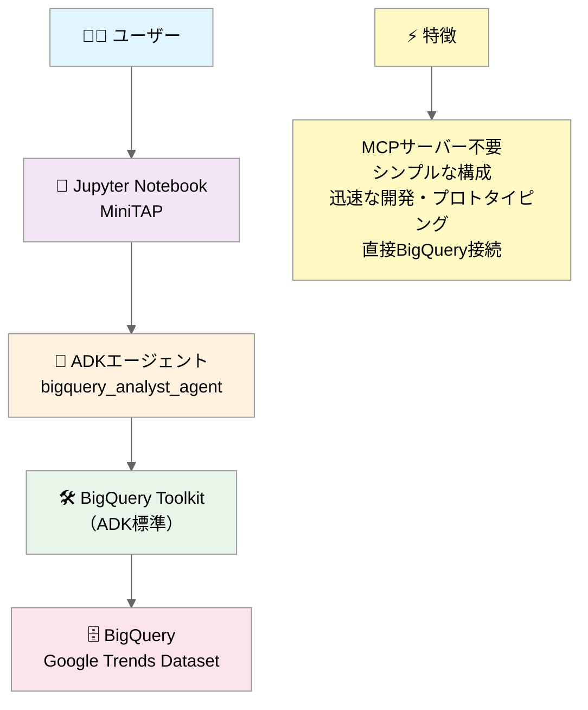
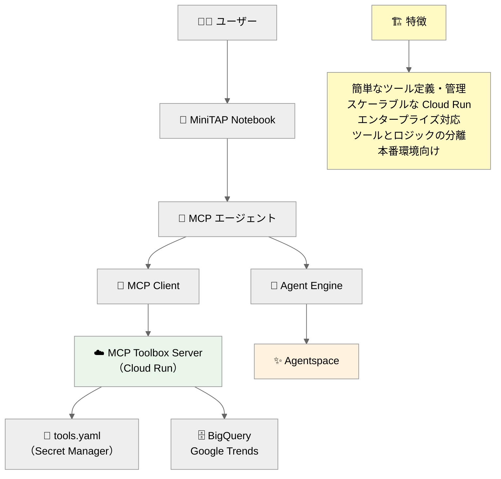

# 🚀 MCP Toolbox for Databases を活用したAgentic Data Analytics MiniTAP


[](https://googleapis.github.io/genai-toolbox/getting-started/introduction/)
[](https://cloud.google.com/)

## 📊 MiniTAP 概要

この MiniTAP は、**MCP (Model Context Protocol) Toolbox for Databases** を活用して、Google Trends データの高度な分析を行うハンズオン学習環境です。ローカルエージェントと Agent Engine の両方で MCP Toolbox を活用し、AI エージェントによるデータ分析の最新手法を体験できます。

### 🎯 主な特徴

- ✅ **ADK (Agent Development Kit) 統合**: ローカル・リモート両対応
- ✅ **MCP Toolbox for Databases 統合**: YAML 設定ベースの柔軟なツール管理
- ✅ **Google Cloud Run デプロイ**: スケーラブルな本番環境対応
- ✅ **BigQuery パブリックデータセット**: Google Trends 国際データの活用
- ✅ **リアルタイム分析**: 最新のトレンドデータによる洞察生成

## 🏗️ アーキテクチャ

```
🧑‍💻 ユーザー
    ↓
📓 Jupyter Notebook (MiniTAP)
    ↓
🤖 ADKエージェント (ローカル/Agent Engine)
    ↓
☁️ MCP Toolbox Server (Cloud Run)
    ↓
🗄️ BigQuery (Google Trends Dataset)
```

### 🔄 2つのデータアクセスアプローチ

#### **パターンA - ADK BigQuery Toolkit**: 迅速開発アプローチ



- ADK の標準 BigQuery ツールキットを使用
- MCP サーバーが不要でアーキテクチャがシンプル
- 学習・プロトタイピングに最適
- エージェントが BigQuery と直接対話

#### **パターンB - MCP Toolbox**: 本格的データ分析基盤



- MCP Toolbox for Databases　を活用
- tools.yaml　による設定ベースの柔軟なツール管理
- Cloud Run　でのスケーラブルなデプロイ
- データアクセスとエージェント思考の分離
- 本番環境・大規模運用に最適

## 🎯 **MiniTAP ハンズオンのゴール**

**「MCP を活用したエージェントによるデータアナリティクスの基本レベル体験」**

### 🎓 **学習成果**
- **MCP アーキテクチャ**の理解と実践的活用
- **MCP Toolbox for Databases**による設定ベースのツール管理
- **Cloud Run**でのスケーラブルなMCPサーバーデプロイ
- **ADK + Agent Engine**での本格的なエージェント開発・運用
- **自然言語によるデータ分析**の実現

### 📚 **想定受講者**
- Google Cloud におけるMCPの活用に興味のある方
- ADK 基礎知識をお持ちの方（miniTAP ADK講座修了相当）
- BigQuery の基本操作を理解されている方

### 🎯 **ハンズオン学習の流れ**
1. **🔧 環境セットアップ** - 認証・プロジェクト設定・MCP基礎理解
2. **☁️ MCP Toolbox 体験** - Cloud Run デプロイと動作確認
3. **🤖 エージェント開発** - MCP経由でのデータ分析実装
4. **🚀 Agent Engine デプロイ** - 本番環境でのスケーラブル運用
5. **✨ Agentspace 連携** - カスタムエージェントの登録と実行

## 🚀 クイックスタート

### 前提条件

- Python 3.10+
- Google Cloud SDK (`gcloud`)
- Jupyter Notebook
- Google Cloud プロジェクト（BigQuery アクセス権限付き）

### 1. 環境セットアップ

```bash
# リポジトリクローン
git clone <repository-url>
cd Data-Aanalyst-Agent

# 依存関係インストール
pip install -r requirements.txt

# Google Cloud認証
gcloud auth application-default login
gcloud config set project YOUR_PROJECT_ID
```

### 2. 自動プロジェクトセットアップ

```bash
# プロジェクトIDの自動検出と設定
python setup/setup_project.py

# BigQuery環境の準備
python setup/bigquery_setup.py
```

### 3. MCP Toolbox デプロイ

```bash
# MCP Toolbox for DatabasesをCloud Runにデプロイ
python setup/deploy_toolbox.py
```

## 📁 プロジェクト構成

```
Data-Aanalyst-Agent/
├── 📓 MiniTAP_Data_Analytics_Hands_On.ipynb    # メインのハンズオン Notebook
├── 📋 requirements.txt                          # Python 依存関係
├── 🔧 bigquery_config.py                       # BigQuery 接続設定（自動生成）
├── 🔗 mcp_config.py                            # MCP 接続設定（自動生成）
├── config/                                      # MCP 設定ファイル
│   ├── __init__.py
│   └── tools.yaml                              # MCP Toolbox ツール定義
├── src/                                        # ソースコード
│   ├── __init__.py
│   └── mcp_client.py                           # MCP クライアントライブラリ
├── setup/                                      # セットアップ・デプロイメント
    ├── setup_project.py                       # プロジェクト自動セットアップ
    ├── bigquery_setup.py                      # BigQuery 環境準備
    ├── deploy_toolbox.py                      # MCP Toolbox デプロイスクリプト
    ├── mcp_config.py                          # MCP接続設定（自動生成）
    ├── Dockerfile                             # コンテナ設定
    └── Dockerfile.custom                      # カスタムコンテナ設定
```

## 🛠️ 主要コンポーネント

### MCP Toolbox ツール (`config/tools.yaml`)

- **execute_sql_tool**: 汎用 BigQuery クエリ実行ツール
- **bigquery_get_dataset_info**: BigQuery データセット情報取得
- **bigquery_get_table_info**: BigQuery テーブル情報取得

### MCPクライアント (`src/mcp_client.py`)

- 軽量なMCP Toolbox接続クライアント
- 非同期処理対応
- 汎用的なツール実行インターフェース
- Jupyter Notebook統合サポート

### セットアップ・デプロイメント (`setup/`)

- **setup_project.py**: Cloud Shell 環境での自動プロジェクトID検出
- **bigquery_setup.py**: BigQuery 環境の自動セットアップ
- **deploy_toolbox.py**: MCP Toolbox for Databases の Cloud Run デプロイ
- **mcp_config.py**: MCP 接続設定（自動生成）

## 🎓 ハンズオンワークフロー

### 学習の進め方

1. **📚 環境セットアップ**
   - 依存ライブラリのインストール
   - Google Cloud 認証とプロジェクト設定
   - BigQuery 接続テスト

2. **⚡ パターンA: ADK BigQuery Toolkit**
   - ADK の標準ツールキットによる迅速な実装
   - BigQuery エージェントの定義と実行
   - 自然言語でのデータ分析体験

3. **🏗️ パターンB: MCP Toolbox**
   - MCP Toolbox for Databases の Cloud Runデプロイ
   - tools.yaml による設定ベースのツール管理
   - より本格的なエージェント開発

4. **🤖 エージェント開発**
   - 両アプローチの比較と実践
   - Google Trends データを使った分析実行
   - 対話型データ分析の体験

5. **☁️ Agent Engineデプロイ**
   - クラウド本番環境への展開
   - スケーラブルなエージェント運用

### 想定学習時間
- **環境セットアップ**: 10分
- **パターンA体験**: 20分
- **パターンB体験**: 25分
- **エージェント開発**: 15分
- **Agent Engineデプロイ**: 20分

**合計: 約1.5時間**

## 📊 使用データセット

**Google Trends - International BigQuery Public Dataset**
- Dataset: `bigquery-public-data.google_trends.international_top_terms`
- 更新頻度: 毎日
- データ範囲: 5年間のローリング履歴
- 地域: 世界各国・地域

### データスキーマ

| カラム | 型 | 説明 |
|--------|----|----|
| `term` | STRING | トレンドキーワード |
| `country_code` | STRING | ISO 3166-2 国コード |
| `country_name` | STRING | 国名 |
| `region_name` | STRING | 地域名 |
| `week` | DATE | 週の開始日 |
| `rank` | INT | 順位 (1-25) |
| `score` | INT | トレンドスコア (0-100) |


## 🔧 設定

### MCP 接続設定 (`setup/mcp_config.py` - 自動生成)

```python
MCP_CONFIG = {
    "server_url": "https://mcp-trends-custom-xxxxx.run.app",
    "project_id": "your-project-id",
    "service_name": "mcp-trends-custom",
    "configuration": "custom-google-trends-tools",
    "toolbox_type": "mcp-toolbox-for-databases-custom"
}
```

### BigQuery 設定 (`bigquery_config.py` - 自動生成)

```python
GOOGLE_CLOUD_PROJECT = "your-project-id"
DATASET_ID = "your-project-id.minitap_analytics"
VIEW_ID = "your-project-id.minitap_analytics.recent_global_trends"
PUBLIC_DATASET = "bigquery-public-data.google_trends.international_top_terms"
```

### MCP Toolbox ツール定義 (`config/tools.yaml`)

```yaml
sources:
  google-trends-bigquery:
    kind: bigquery
    project: your-project-id
    location: us

tools:
  execute_sql_tool:
    kind: bigquery-execute-sql
    source: google-trends-bigquery
    description: "Execute SQL query on Google Trends BigQuery dataset"
    
toolsets:
  google-trends-analysis:
    - execute_sql_tool
    - bigquery_get_dataset_info
    - bigquery_get_table_info
```

## 🚀 デプロイメント

### Cloud Run 自動デプロイ

```bash
# MCP Toolbox for Databases のデプロイ
python setup/deploy_toolbox.py

# プロジェクトIDを明示的に指定する場合
python setup/deploy_toolbox.py --project-id YOUR_PROJECT_ID
```

## 🔍 トラブルシューティング

### よくある問題

#### 認証エラー
```bash
# 解決策
gcloud auth application-default login
gcloud config set project YOUR_PROJECT_ID
```

#### MCP 接続エラー
```bash
# デプロイ状況確認
python tests/test_custom_toolbox.py --quick

# 設定ファイル確認
cat setup/mcp_config.py

# Cloud Runサービス確認
gcloud run services list --filter="mcp-trends-custom"
```

#### プロジェクトセットアップエラー
```bash
# プロジェクトID設定確認
gcloud config get-value project

# プロジェクト自動設定の再実行
python setup/setup_project.py

# BigQuery環境の再設定
python setup/bigquery_setup.py
```

#### Agent Engine デプロイエラー
- 権限確認: Service Account に必要な役割が付与されているか
- 依存関係確認: requirements.txt の内容が正しいか
- ネットワーク確認: Cloud Run サービスへのアクセス可能性

## 📚 学習リソース

- [MCP Toolbox for Databases 公式ドキュメント](https://cloud.google.com/vertex-ai/generative-ai/docs/toolbox)
- [Google ADK (Agent Development Kit)](https://cloud.google.com/vertex-ai/generative-ai/docs/agent-development-kit)
- [BigQuery Google Trends データセット](https://console.cloud.google.com/marketplace/product/google/google-trends)

---

**✨ Happy Analytics with MCP Toolbox! 📊**
